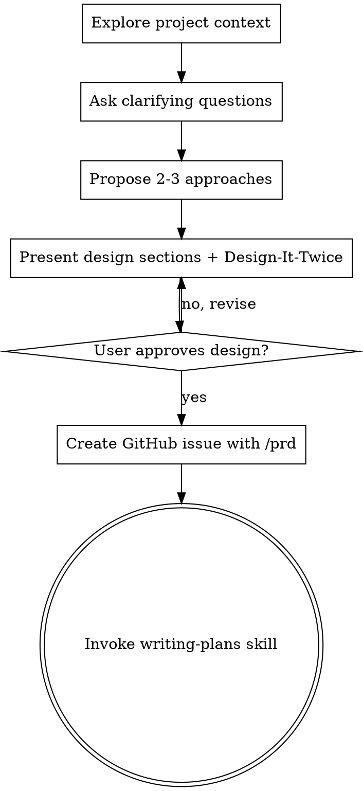
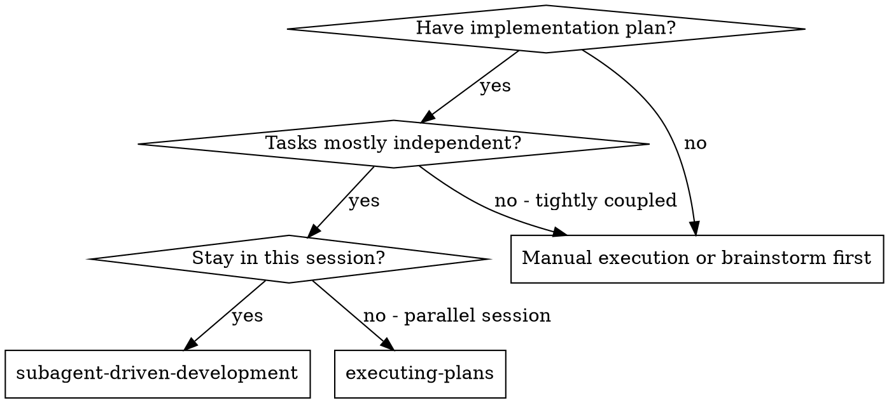
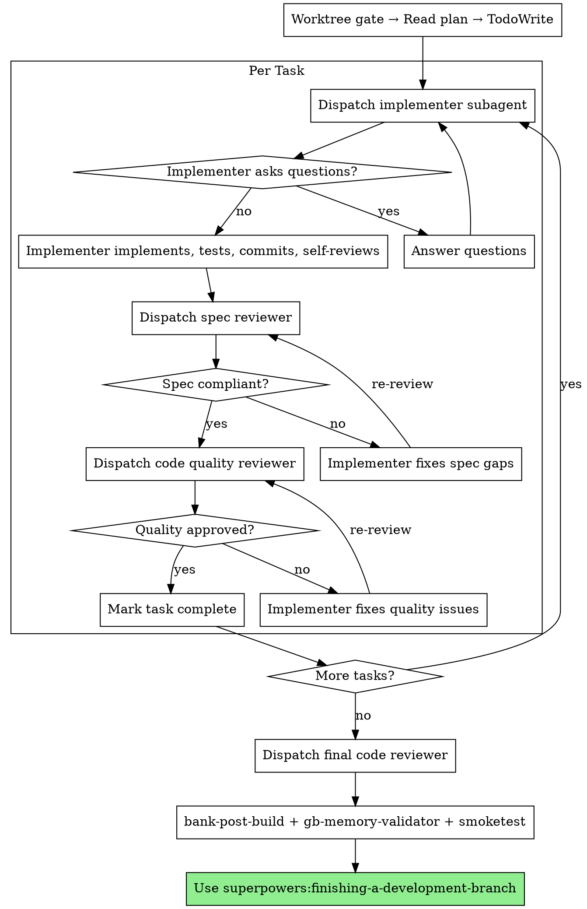

# Project-Specific Plan/Execution Skills Implementation Plan

> **For Claude:** REQUIRED SUB-SKILL: Use superpowers:executing-plans to implement this plan task-by-task.

**Goal:** Create six project-local shadow skills that embed mandatory GBC gate sequences so compliance is automatic rather than memory-dependent.

**Architecture:** Each skill is a `.claude/skills/<name>/SKILL.md` file that shadows the global superpowers version. Shadows are created by copying the global source verbatim then applying targeted edits. No C code, no tests (`make test` is C-only).

**Tech Stack:** Markdown skill files; invoke `writing-skills` skill before writing each file.

**Issue:** Closes #115

---

## Pre-flight

Before starting any task, confirm you are in the worktree at:
`/home/mathdaman/code/gmb-nuke-raider/.claude/worktrees/gb-plan-skills`

Run `git branch --show-current` — expected: `gb-plan-skills` (or similar feature branch).

**IMPORTANT:** These are markdown files only. No `bank-pre-write` or `gbdk-expert` gates are needed (those gates apply to `src/*.c` / `src/*.h` only).

---

## Task 1: writing-plans shadow skill

**Files:**
- Create: `.claude/skills/writing-plans/SKILL.md`

**Step 1: Read source skill**

Read the global source: `~/.claude/plugins/superpowers/skills/writing-plans/SKILL.md`

**Step 2: Invoke writing-skills skill**

Run: `Skill("writing-skills")`
Follow its instructions for creating a new project skill.

**Step 3: Create the shadow skill**

Create `.claude/skills/writing-plans/SKILL.md` with the following exact content:

````markdown
---
name: writing-plans
description: Use when you have a spec or requirements for a multi-step task, before touching code
---

# Writing Plans

## Overview

Write comprehensive implementation plans assuming the engineer has zero context for our codebase and questionable taste. Document everything they need to know: which files to touch for each task, code, testing, docs they might need to check, how to test it. Give them the whole plan as bite-sized tasks. DRY. YAGNI. TDD. Frequent commits.

Assume they are a skilled developer, but know almost nothing about our toolset or problem domain. Assume they don't know good test design very well.

**Announce at start:** "I'm using the writing-plans skill to create the implementation plan."

**Context:** This should be run in a dedicated worktree (created by brainstorming skill).

**Save plans to:** `docs/plans/YYYY-MM-DD-<feature-name>.md`

## Hard Gate Sequence

Every task that touches `src/*.c` or `src/*.h` MUST follow this exact sequence — no exceptions:

| Step | Action |
|------|--------|
| 1 | Write failing test (`make test` → FAIL) |
| 2 | Invoke `bank-pre-write` skill (HARD GATE) |
| 3 | Invoke `gbdk-expert` agent (HARD GATE) |
| 4 | Write the C file |
| 5 | Run tests (`make test` → PASS) |
| 6 | Build ROM (`GBDK_HOME=/home/mathdaman/gbdk make` → PASS) |
| 7 | Invoke `bank-post-build` skill (HARD GATE) |
| 8 | Commit |

Non-C tasks (markdown, Python, JSON, assets): write → verify → commit. No bank gates.

## Bite-Sized Task Granularity

**Each step is one action (2-5 minutes):**
- "Write the failing test" - step
- "Run it to make sure it fails" - step
- "Implement the minimal code to make the test pass" - step
- "Run the tests and make sure they pass" - step
- "Commit" - step

## Plan Document Header

**Every plan MUST start with this header:**

```markdown
# [Feature Name] Implementation Plan

> **For Claude:** REQUIRED SUB-SKILL: Use superpowers:executing-plans to implement this plan task-by-task.

**Goal:** [One sentence describing what this builds]

**Architecture:** [2-3 sentences about approach]

**Tech Stack:** [Key technologies/libraries]

---
```

## C-File Task Template

Use this template for any task that creates or modifies `src/*.c` or `src/*.h`:

````markdown
### Task N: [Component Name]

**Files:**
- Create: `src/foo.c`, `src/foo.h`
- Test: `tests/test_foo.c`

**Step 1: Write the failing test**

```c
void test_foo_init(void) {
    foo_init();
    TEST_ASSERT_EQUAL_UINT8(0, foo_get_count());
}
```

**Step 2: Run test to verify it fails**

Run: `make test`
Expected: FAIL (undefined symbol or missing include)

**Step 3: HARD GATE — bank-pre-write**

Invoke the `bank-pre-write` skill. Verify `bank-manifest.json` has an entry for `src/foo.c`.
Do NOT write the C file until this gate passes.

**Step 4: HARD GATE — gbdk-expert**

Invoke the `gbdk-expert` agent. Confirm the planned API, data types, and any GBDK calls are
correct for this module before writing.

**Step 5: Write minimal implementation**

```c
/* src/foo.c */
#pragma bank 0
#include "foo.h"
/* ... */
```

**Step 6: Run tests to verify they pass**

Run: `make test`
Expected: PASS

**Step 7: HARD GATE — build**

Invoke the `build` skill (or run: `GBDK_HOME=/home/mathdaman/gbdk make`).
Expected: ROM produced at `build/nuke-raider.gb`, zero errors.

**Step 8: HARD GATE — bank-post-build**

Invoke the `bank-post-build` skill. Verify bank placements and ROM budgets are within limits.

**Step 9: Commit**

```bash
git add src/foo.c src/foo.h tests/test_foo.c bank-manifest.json
git commit -m "feat: add foo module"
```
````

## Non-C Task Template

Use this template for tasks that do NOT involve `src/*.c` or `src/*.h`:

````markdown
### Task N: [Component Name]

**Files:**
- Create/Modify: `path/to/file.md`

**Step 1: Write the content**

[exact content or diff]

**Step 2: Verify**

[manual check or command]

**Step 3: Commit**

```bash
git add path/to/file.md
git commit -m "feat: add/update X"
```
````

## Remember
- Exact file paths always
- Complete code in plan (not "add validation")
- Exact commands with expected output
- Reference relevant skills with @ syntax
- DRY, YAGNI, TDD, frequent commits
- C files ALWAYS get the 9-step template with all three HARD GATE steps

## Execution Handoff

After saving the plan, offer execution choice:

**"Plan complete and saved to `docs/plans/<filename>.md`. Two execution options:**

**1. Subagent-Driven (this session)** - I dispatch fresh subagent per task, review between tasks, fast iteration

**2. Parallel Session (separate)** - Open new session with executing-plans, batch execution with checkpoints

**Which approach?"**

**If Subagent-Driven chosen:**
- **REQUIRED SUB-SKILL:** Use superpowers:subagent-driven-development
- Stay in this session
- Fresh subagent per task + code review

**If Parallel Session chosen:**
- Guide them to open new session in worktree
- **REQUIRED SUB-SKILL:** New session uses superpowers:executing-plans
````

**Step 4: Verify the file was created correctly**

Check that:
- Hard gate sequence table is present
- C-file task template has 9 steps with bank-pre-write (step 3), gbdk-expert (step 4), bank-post-build (step 8) all labeled HARD GATE
- Non-C task template is present

**Step 5: Commit**

```bash
git add .claude/skills/writing-plans/SKILL.md
git commit -m "feat: add writing-plans shadow skill with GB hard gates"
```

---

## Task 2: executing-plans shadow skill

**Files:**
- Create: `.claude/skills/executing-plans/SKILL.md`

**Step 1: Read source skill**

Read: `~/.claude/plugins/superpowers/skills/executing-plans/SKILL.md`

**Step 2: Invoke writing-skills skill**

Run: `Skill("writing-skills")`

**Step 3: Create the shadow skill**

Create `.claude/skills/executing-plans/SKILL.md` with the following exact content:

````markdown
---
name: executing-plans
description: Use when you have a written implementation plan to execute in a separate session with review checkpoints
---

# Executing Plans

## Overview

Load plan, review critically, execute tasks in batches, report for review between batches.

**Core principle:** Batch execution with checkpoints for architect review.

**Announce at start:** "I'm using the executing-plans skill to implement this plan."

## The Process

### Step 1: HARD GATE — Enter Worktree

Before reading the plan or touching any file, confirm you are in a git worktree (NOT the main repo):

```bash
git worktree list
git branch --show-current
pwd
```

Expected: current directory is under `.claude/worktrees/` and branch is a feature branch (not `master`).

If not in a worktree: use the `using-git-worktrees` skill or `EnterWorktree` tool before proceeding.

### Step 2: Load and Review Plan

1. Read plan file
2. Review critically — identify any questions or concerns about the plan
3. If concerns: raise them with your human partner before starting
4. If no concerns: create TodoWrite tasks and proceed

### Step 3: Execute Batch

**Default: first 3 tasks**

For each task:
1. Mark as in_progress
2. Follow each step exactly (plan has bite-sized steps)
3. Before writing any `src/*.c` or `src/*.h` file:
   - Invoke `bank-pre-write` skill (HARD GATE)
   - Invoke `gbdk-expert` agent (HARD GATE)
4. After any successful build:
   - Invoke `bank-post-build` skill (HARD GATE)
5. Run verifications as specified
6. Mark as completed

### Step 4: Report

When batch complete:
- Show what was implemented
- Show verification output
- Say: "Ready for feedback."

### Step 5: Continue

Based on feedback:
- Apply changes if needed
- Execute next batch
- Repeat until complete

### Step 6: Complete Development

After all tasks complete and verified, run the smoketest sequence:

1. Fetch and merge latest master (from the worktree directory):
   ```bash
   git fetch origin && git merge origin/master
   ```
   NEVER use `git merge master` alone — the local master ref may be stale.

2. Rebuild:
   ```bash
   GBDK_HOME=/home/mathdaman/gbdk make
   ```

3. Run `gb-memory-validator` agent — if any budget is FAIL, stop and fix before continuing.

4. Launch the ROM immediately in the background (run from the worktree directory):
   ```bash
   java -jar /home/mathdaman/.local/share/emulicious/Emulicious.jar build/nuke-raider.gb
   ```
   Tell the user it's running and ask them to confirm it looks correct.

5. Only after the user confirms: proceed to finishing-a-development-branch.

Announce: "I'm using the finishing-a-development-branch skill to complete this work."
**REQUIRED SUB-SKILL:** Use superpowers:finishing-a-development-branch
Follow that skill to verify tests, present options, execute choice.

## When to Stop and Ask for Help

**STOP executing immediately when:**
- Hit a blocker mid-batch (missing dependency, test fails, instruction unclear)
- Plan has critical gaps preventing starting
- You don't understand an instruction
- Verification fails repeatedly
- Any HARD GATE fails (bank-pre-write, gbdk-expert, bank-post-build)

**Ask for clarification rather than guessing.**

## When to Revisit Earlier Steps

**Return to Review (Step 2) when:**
- Partner updates the plan based on your feedback
- Fundamental approach needs rethinking

**Don't force through blockers** — stop and ask.

## Remember
- Enter worktree FIRST (Step 1) before any other action
- Review plan critically before starting
- Follow plan steps exactly
- Don't skip verifications
- Reference skills when plan says to
- Between batches: just report and wait
- Stop when blocked, don't guess
- Never start implementation on main/master branch
- bank-pre-write + gbdk-expert gates before every C write
- bank-post-build gate after every build
- Smoketest uses Emulicious, not mgba-qt
- Merge command is `git fetch origin && git merge origin/master`

## Integration

**Required workflow skills:**
- **superpowers:using-git-worktrees** — REQUIRED: set up isolated workspace before starting
- **superpowers:writing-plans** — creates the plan this skill executes
- **superpowers:finishing-a-development-branch** — complete development after all tasks
````

**Step 4: Verify the file was created correctly**

Check that:
- Step 1 is the worktree hard gate
- bank-pre-write + gbdk-expert appear in Step 3 for C writes
- bank-post-build appears in Step 3 after builds
- Smoketest uses `java -jar /home/mathdaman/.local/share/emulicious/Emulicious.jar build/nuke-raider.gb`
- Merge uses `git fetch origin && git merge origin/master`

**Step 5: Commit**

```bash
git add .claude/skills/executing-plans/SKILL.md
git commit -m "feat: add executing-plans shadow skill with worktree gate and bank gates"
```

---

## Task 3: brainstorming shadow skill

**Files:**
- Create: `.claude/skills/brainstorming/SKILL.md`

**Step 1: Read source skill**

Read: `~/.claude/plugins/superpowers/skills/brainstorming/SKILL.md`

**Step 2: Invoke writing-skills skill**

Run: `Skill("writing-skills")`

**Step 3: Create the shadow skill**

Create `.claude/skills/brainstorming/SKILL.md` with the following exact content:

````markdown
---
name: brainstorming
description: "You MUST use this before any creative work - creating features, building components, adding functionality, or modifying behavior. Explores user intent, requirements and design before implementation."
---

# Brainstorming Ideas Into Designs

## Overview

Help turn ideas into fully formed designs and specs through natural collaborative dialogue.

Start by understanding the current project context, then ask questions one at a time to refine the idea. Once you understand what you're building, present the design and get user approval.

<HARD-GATE>
Do NOT invoke any implementation skill, write any code, scaffold any project, or take any implementation action until you have presented a design and the user has approved it. This applies to EVERY project regardless of perceived simplicity.
</HARD-GATE>

## Anti-Pattern: "This Is Too Simple To Need A Design"

Every project goes through this process. A todo list, a single-function utility, a config change — all of them. "Simple" projects are where unexamined assumptions cause the most wasted work. The design can be short (a few sentences for truly simple projects), but you MUST present it and get approval.

## Checklist

You MUST create a task for each of these items and complete them in order:

1. **Explore project context** — check files, docs, recent commits
2. **Ask clarifying questions** — one at a time, understand purpose/constraints/success criteria
3. **Propose 2-3 approaches** — with trade-offs and your recommendation
4. **Present design** — in sections scaled to their complexity, get user approval after each section;
   include a **Design-It-Twice** step: sketch two alternative module interfaces / APIs for any new
   `src/*.c` module, compare them explicitly, then choose the better one
5. **Create GitHub issue** — use `/prd` skill to create a GitHub issue with the design as a PRD.
   Do NOT save a local design doc file. The GitHub issue IS the design doc.
6. **Transition to implementation** — invoke writing-plans skill to create implementation plan

## GB Constraint Checklist

When designing any GBC feature, explicitly address all of these in your design:

| Constraint | Question to answer |
|------------|-------------------|
| **Banking** | Which ROM bank does this code live in? Does it call code in other banks? Are SET_BANK calls safe? |
| **OAM** | How many OAM sprite slots does this use? Running total vs. budget of 40? |
| **WRAM** | How many bytes of WRAM does this use? Are all large arrays global/static (not local)? |
| **VRAM** | How many tiles does this consume? Running total vs. budget of 192 (bank 0) + 192 (bank 1)? |
| **SoA** | Are entity pools Structure-of-Arrays (not Array-of-Structs)? |
| **SDCC** | Any compound literals, float, malloc, large locals, or non-uint8_t loop counters? |
| **Testability** | Which logic can be host-side tested with `make test` (no hardware)? |

## Process Flow



**The terminal state is invoking writing-plans.** Do NOT invoke frontend-design, mcp-builder, or any other implementation skill. The ONLY skill you invoke after brainstorming is writing-plans.

## The Process

**Understanding the idea:**
- Check out the current project state first (files, docs, recent commits)
- Ask questions one at a time to refine the idea
- Prefer multiple choice questions when possible, but open-ended is fine too
- Only one question per message — if a topic needs more exploration, break it into multiple questions
- Focus on understanding: purpose, constraints, success criteria

**Exploring approaches:**
- Propose 2-3 different approaches with trade-offs
- Present options conversationally with your recommendation and reasoning
- Lead with your recommended option and explain why

**Presenting the design:**
- Once you believe you understand what you're building, present the design
- Scale each section to its complexity: a few sentences if straightforward, up to 200-300 words if nuanced
- Ask after each section whether it looks right so far
- Cover: architecture, components, data flow, error handling, testing
- For any new `src/*.c` module: sketch two alternative interfaces (Design-It-Twice), compare them,
  choose the better one — document why
- Work through the GB Constraint Checklist explicitly for any GBC feature
- Be ready to go back and clarify if something doesn't make sense

## After the Design

**Documentation:**
- Use `/prd` skill to create a GitHub issue with the design
- Do NOT save a local `docs/plans/` file — the GitHub issue is the design doc
- Share the issue URL with the user

**Implementation:**
- Invoke the writing-plans skill to create a detailed implementation plan
- Do NOT invoke any other skill. writing-plans is the next step.

## Key Principles

- **One question at a time** — don't overwhelm with multiple questions
- **Multiple choice preferred** — easier to answer than open-ended when possible
- **YAGNI ruthlessly** — remove unnecessary features from all designs
- **Explore alternatives** — always propose 2-3 approaches before settling
- **Incremental validation** — present design, get approval before moving on
- **Be flexible** — go back and clarify when something doesn't make sense
- **GB constraints first** — work through the constraint checklist before finalizing any GBC design
````

**Step 4: Verify the file was created correctly**

Check that:
- Step 5 says "Create GitHub issue" / use `/prd` (not "Write design doc to docs/plans/")
- GB Constraint Checklist table is present with all 7 rows (banking, OAM, WRAM, VRAM, SoA, SDCC, testability)
- Design-It-Twice step is present in the checklist and process sections
- No mention of saving local design doc files

**Step 5: Commit**

```bash
git add .claude/skills/brainstorming/SKILL.md
git commit -m "feat: add brainstorming shadow skill with /prd redirect and GB constraint checklist"
```

---

## Task 4: finishing-a-development-branch shadow skill

**Files:**
- Create: `.claude/skills/finishing-a-development-branch/SKILL.md`

**Step 1: Read source skill**

Read: `~/.claude/plugins/superpowers/skills/finishing-a-development-branch/SKILL.md`

**Step 2: Invoke writing-skills skill**

Run: `Skill("writing-skills")`

**Step 3: Create the shadow skill**

Create `.claude/skills/finishing-a-development-branch/SKILL.md` with the following exact content:

````markdown
---
name: finishing-a-development-branch
description: Use when implementation is complete, all tests pass, and you need to decide how to integrate the work - guides completion of development work by presenting structured options for merge, PR, or cleanup
---

# Finishing a Development Branch

## Overview

Guide completion of development work by presenting clear options and handling chosen workflow.

**Core principle:** Verify tests → Bank gates → Smoketest → Present options → Execute choice → Clean up.

**Announce at start:** "I'm using the finishing-a-development-branch skill to complete this work."

## The Process

### Step 1: Verify Tests

**Before presenting options, verify tests pass:**

```bash
make test
```

**If tests fail:**
```
Tests failing (<N> failures). Must fix before completing:

[Show failures]

Cannot proceed with merge/PR until tests pass.
```

Stop. Don't proceed to Step 2.

**If tests pass:** Continue to Step 2.

### Step 2: HARD GATE — bank-post-build + gb-memory-validator

**Run these before the smoketest:**

1. Invoke the `bank-post-build` skill. If it reports any FAIL, stop and fix before continuing.
2. Run the `gb-memory-validator` agent. If any budget is FAIL, stop and fix before continuing.

Only continue to Step 3 when both gates pass.

### Step 3: Smoketest in Emulicious

1. Fetch and merge latest master (from the **worktree** directory — never from the main repo):
   ```bash
   git fetch origin && git merge origin/master
   ```

2. Rebuild from the worktree directory:
   ```bash
   GBDK_HOME=/home/mathdaman/gbdk make
   ```

3. Launch the ROM immediately in the background (from the worktree directory so `build/` resolves
   to the worktree's build output — NEVER from the main repo's `build/`):
   ```bash
   java -jar /home/mathdaman/.local/share/emulicious/Emulicious.jar build/nuke-raider.gb
   ```

4. Tell the user it's running and ask them to confirm it looks correct before proceeding.

**Stop. Wait for explicit confirmation.**

- If issues found: work with user to fix before continuing
- If confirmed: Continue to Step 4

### Step 4: Determine Base Branch

```bash
git merge-base HEAD main 2>/dev/null || git merge-base HEAD master 2>/dev/null
```

Or ask: "This branch split from master — is that correct?"

### Step 5: Present Options

Present exactly these 3 options:

```
Implementation complete. What would you like to do?

1. Push and create a Pull Request  ← default
2. Keep the branch as-is (I'll handle it later)
3. Discard this work

Which option?
```

**NEVER offer "merge to main locally"** — all work merges via PR.

**Don't add explanation** — keep options concise.

### Step 6: Execute Choice

#### Option 1: Push and Create PR

```bash
# Push branch
git push -u origin <feature-branch>

# Create PR
gh pr create --title "<title>" --body "$(cat <<'EOF'
## Summary
<2-3 bullets of what changed>

## Test Plan
- [ ] make test passes
- [ ] Emulicious smoketest confirmed by user
- [ ] bank-post-build gates passed
- [ ] gb-memory-validator: no FAIL budgets

Closes #N
EOF
)"
```

Then: Cleanup worktree (Step 7)

#### Option 2: Keep As-Is

Report: "Keeping branch <name>. Worktree preserved at <path>."

**Don't cleanup worktree.**

#### Option 3: Discard

**Confirm first:**
```
This will permanently delete:
- Branch <name>
- All commits: <commit-list>
- Worktree at <path>

Type 'discard' to confirm.
```

Wait for exact confirmation.

If confirmed:
```bash
git checkout master
git branch -D <feature-branch>
```

Then: Cleanup worktree (Step 7)

### Step 7: Cleanup Worktree

**For Options 1 and 3:**

Check if in worktree:
```bash
git worktree list | grep $(git branch --show-current)
```

If yes:
```bash
git worktree remove <worktree-path>
```

**For Option 2:** Keep worktree.

## Quick Reference

| Option | Push | Keep Worktree | Cleanup Branch |
|--------|------|---------------|----------------|
| 1. Create PR | ✓ | ✓ | - |
| 2. Keep as-is | - | ✓ | - |
| 3. Discard | - | - | ✓ (force) |

## Common Mistakes

**Wrong emulator or ROM name**
- **Problem:** Using `mgba-qt` or wrong ROM path loses time and gives wrong results
- **Fix:** Always use `java -jar /home/mathdaman/.local/share/emulicious/Emulicious.jar build/nuke-raider.gb`

**Launching from wrong directory**
- **Problem:** Main repo's `build/` may be stale; must use worktree's `build/`
- **Fix:** Run emulator command from the worktree directory, not the main repo

**Skipping bank gates**
- **Problem:** Undetected bank overflow causes blank screen / ~1-2 FPS
- **Fix:** Always run bank-post-build and gb-memory-validator before smoketest

**Using bare `git merge master`**
- **Problem:** Local master ref may be stale; silently merges old code
- **Fix:** Always `git fetch origin && git merge origin/master`

**Merging directly to main**
- **Problem:** Bypasses review, violates branch policy
- **Fix:** Always use a PR — never `git merge` to main locally

**Skipping test verification**
- **Problem:** Merge broken code, create failing PR
- **Fix:** Always verify tests before offering options

## Red Flags

**Never:**
- Commit directly to `master`
- Merge feature branch locally without a PR
- Proceed with failing tests
- Delete work without confirmation
- Force-push without explicit request
- Use `mgba-qt` (wrong emulator)
- Reference `wasteland-racer.gb` (wrong ROM name)
- Launch emulator from main repo's `build/` (may be stale)
- Skip bank-post-build or gb-memory-validator before smoketest

**Always:**
- Work on a feature branch
- Integrate via PR only
- Verify tests before offering options
- Run bank-post-build + gb-memory-validator before smoketest
- Fetch + merge origin/master before smoketest rebuild
- Launch Emulicious from worktree directory
- Present exactly 3 options
- Get typed confirmation for Option 3
- Clean up worktree for Options 1 & 3 only

## Integration

**Called by:**
- **subagent-driven-development** (final step) — after all tasks complete
- **executing-plans** (Step 6) — after all batches complete

**Pairs with:**
- **using-git-worktrees** — cleans up worktree created by that skill
````

**Step 4: Verify the file was created correctly**

Check that:
- No reference to `mgba-qt` or `wasteland-racer`
- Emulicious command is `java -jar /home/mathdaman/.local/share/emulicious/Emulicious.jar build/nuke-raider.gb`
- Step 2 is bank-post-build + gb-memory-validator HARD GATE
- Step 3 merge command is `git fetch origin && git merge origin/master`
- "run from worktree directory" note is present

**Step 5: Commit**

```bash
git add .claude/skills/finishing-a-development-branch/SKILL.md
git commit -m "feat: add finishing-a-development-branch shadow skill with Emulicious and bank gates"
```

---

## Task 5: subagent-driven-development shadow skill

**Files:**
- Create: `.claude/skills/subagent-driven-development/SKILL.md`

**Step 1: Read source skill**

Read: `~/.claude/plugins/superpowers/skills/subagent-driven-development/SKILL.md`

**Step 2: Invoke writing-skills skill**

Run: `Skill("writing-skills")`

**Step 3: Create the shadow skill**

Create `.claude/skills/subagent-driven-development/SKILL.md` with the following exact content:

````markdown
---
name: subagent-driven-development
description: Use when executing implementation plans with independent tasks in the current session
---

# Subagent-Driven Development

Execute plan by dispatching fresh subagent per task, with two-stage review after each: spec compliance review first, then code quality review.

**Core principle:** Fresh subagent per task + two-stage review (spec then quality) = high quality, fast iteration

## HARD GATE: Worktree Required

Before reading the plan or dispatching any subagent, confirm you are in a git worktree:

```bash
git worktree list
git branch --show-current
pwd
```

Expected: current directory is under `.claude/worktrees/` and branch is a feature branch (not `master`).

If not in a worktree: use the `using-git-worktrees` skill or `EnterWorktree` tool before proceeding.

## When to Use



## The Process



## Implementer Dispatch Instructions

When dispatching the implementer subagent, include ALL of the following in the prompt:

1. Full task text from the plan (do NOT make the subagent read the plan file)
2. Scene-setting context (where this task fits in the overall feature)
3. **Mandatory GB gate instructions:**

   > Before writing any `src/*.c` or `src/*.h` file:
   > 1. Invoke the `bank-pre-write` skill (HARD GATE) — verify bank-manifest.json entry exists
   > 2. Invoke the `gbdk-expert` agent (HARD GATE) — confirm API, data types, GBDK calls
   > Only write the C file AFTER both gates pass.
   >
   > After any successful build:
   > 1. Invoke the `bank-post-build` skill (HARD GATE) — verify bank placements and budgets
   >
   > Follow TDD: write failing test first, make it pass, then build.

## Post-Build Review Step

After all tasks are complete and the final code reviewer approves, run the post-build review:

1. Invoke `bank-post-build` skill — if FAIL, stop and fix
2. Run `gb-memory-validator` agent — if any budget is FAIL, stop and fix
3. Run smoketest sequence:
   ```bash
   # From the worktree directory
   git fetch origin && git merge origin/master
   GBDK_HOME=/home/mathdaman/gbdk make
   java -jar /home/mathdaman/.local/share/emulicious/Emulicious.jar build/nuke-raider.gb
   ```
   Tell the user it's running. Wait for their confirmation before proceeding.

Only after smoketest confirmed: use `superpowers:finishing-a-development-branch`.

## Example Workflow

```
[Worktree gate confirmed]
[Read plan: docs/plans/feature-plan.md]
[Extract all 5 tasks with full text and context]
[Create TodoWrite with all tasks]

Task 1: Add foo module

[Dispatch implementer with: task text + context + GB gate instructions]

Implementer: "Before I begin — should foo_init() take a config struct?"

You: "No config needed, just init to defaults"

Implementer: [Follows TDD, invokes bank-pre-write, gbdk-expert, writes C, runs tests,
              builds ROM, invokes bank-post-build, commits]

[Dispatch spec reviewer]
Spec reviewer: ✅ Spec compliant

[Dispatch code quality reviewer]
Code reviewer: ✅ Approved

[Mark Task 1 complete]

...

[After all tasks]
[Dispatch final code-reviewer]
Final reviewer: All requirements met

[Run bank-post-build + gb-memory-validator]
[Run smoketest → user confirms]
[Use finishing-a-development-branch]
```

## Red Flags

**Never:**
- Start implementation on main/master branch
- Skip worktree gate
- Skip reviews (spec compliance OR code quality)
- Proceed with unfixed issues
- Dispatch multiple implementation subagents in parallel (conflicts)
- Make subagent read plan file (provide full text instead)
- Skip scene-setting context (subagent needs to understand where task fits)
- Ignore subagent questions (answer before letting them proceed)
- Accept "close enough" on spec compliance
- Skip review loops (reviewer found issues = implementer fixes = review again)
- Start code quality review before spec compliance is ✅
- Move to next task while either review has open issues
- Skip bank-pre-write or gbdk-expert before any C write
- Skip bank-post-build or gb-memory-validator in post-build review
- Launch smoketest from main repo's build/ (use worktree's build/)

## Integration

**Required workflow skills:**
- **superpowers:using-git-worktrees** — REQUIRED: set up isolated workspace before starting
- **superpowers:writing-plans** — creates the plan this skill executes
- **superpowers:requesting-code-review** — code review template for reviewer subagents
- **superpowers:finishing-a-development-branch** — complete development after all tasks

**Subagents should use:**
- **superpowers:test-driven-development** — subagents follow TDD for each task
- **bank-pre-write** — before every C write
- **gbdk-expert** — before every C write
- **bank-post-build** — after every build

**Alternative workflow:**
- **superpowers:executing-plans** — use for parallel session instead of same-session execution
````

**Step 4: Verify the file was created correctly**

Check that:
- Worktree hard gate is at the very top of the skill (before "When to Use")
- Implementer dispatch instructions include bank-pre-write + gbdk-expert with exact wording
- Post-build review step includes bank-post-build + gb-memory-validator + smoketest sequence
- Smoketest uses Emulicious path, not mgba-qt

**Step 5: Commit**

```bash
git add .claude/skills/subagent-driven-development/SKILL.md
git commit -m "feat: add subagent-driven-development shadow skill with worktree gate and bank gates"
```

---

## Task 6: grill-me new skill

**Files:**
- Create: `.claude/skills/grill-me/SKILL.md`

**Step 1: Review source reference**

The upstream grill-me from mattpocock is intentionally minimal:
> "Interview me relentlessly about every aspect of this plan until we reach a shared understanding.
> Walk down each branch of the design tree, resolving dependencies between decisions one-by-one.
> If a question can be answered by exploring the codebase, explore the codebase instead."

This project's version extends it with GB-specific constraint areas and a structured summary at the end.

**Step 2: Invoke writing-skills skill**

Run: `Skill("writing-skills")`

**Step 3: Create the new skill**

Create `.claude/skills/grill-me/SKILL.md` with the following exact content:

````markdown
---
name: grill-me
description: Interview the user relentlessly about a plan or design until reaching shared understanding, resolving each branch of the decision tree. Use when user wants to stress-test a plan, get grilled on their design, or mentions "grill me".
---

# Grill Me

Interview me relentlessly about every aspect of this plan until we reach a shared understanding. Walk down each branch of the design tree, resolving dependencies between decisions one-by-one.

If a question can be answered by exploring the codebase, explore the codebase instead of asking.

## GB Constraint Question Areas

For any GBC feature plan, work through ALL of these areas. Ask one question at a time.

### 1. Banking
- Which ROM bank does this code live in?
- Does it call functions in other banks? Are those cross-bank calls safe (SET_BANK used correctly)?
- Are any data arrays large enough to need banking? Which bank?
- Have you checked the current bank budget (`make bank-post-build`)?

### 2. OAM Budget
- How many OAM sprite slots does this feature consume?
- What is the running total vs. the 40-slot budget?
- Player uses 2 slots — are those already counted?
- Do any sprites share tiles to save OAM slots?

### 3. WRAM Budget
- How many bytes of WRAM does this feature use?
- Are all large arrays declared global or static (not local, to avoid stack overflow)?
- Total WRAM budget is 8 KB — what is the current usage?

### 4. VRAM Budget
- How many tiles does this feature consume (DMG bank 0 and/or CGB bank 1)?
- Running total vs. 192 tiles per bank?
- Are there any tile-sharing opportunities?

### 5. SoA vs AoS
- Are entity pools Structure-of-Arrays (SoA), not Array-of-Structs (AoS)?
- If there is a struct per entity, why can't it be SoA?
- Hot loop access pattern — does it iterate one field at a time (SoA wins) or all fields per entity (AoS might be acceptable)?

### 6. SDCC Constraints
- Any compound literals `(const uint16_t[]){...}`? (SDCC rejects these — use named static const arrays)
- Any float or double? (Forbidden — use fixed-point)
- Any malloc/free? (Forbidden — use static allocation)
- Any large local arrays (>~64 bytes)? (Stack overflow risk — use static or global)
- Loop counters: are they uint8_t (preferred) or int (wasteful)?

### 7. Testability
- Which parts of the logic can be tested host-side with `make test` (no hardware)?
- Which parts require the emulator to verify?
- Is there a clear boundary between pure logic (testable) and hardware I/O (not testable)?

## Process

1. Ask one question at a time from the relevant constraint areas above
2. If the answer reveals a problem, ask follow-up questions to resolve it before moving on
3. Explore the codebase to answer questions where possible (don't speculate)
4. Keep asking until every branch of the decision tree is resolved

## Summary

When all areas are covered, provide a structured summary:

```
## Grill-Me Summary

### Resolved Decisions
- [Decision]: [What was decided and why]
- ...

### Unresolved / Open Questions
- [Question]: [Why it remains open, what information is needed]
- ...

### Risk Areas
- [Area]: [Specific concern to watch during implementation]
- ...
```
````

**Step 4: Verify the file was created correctly**

Check that:
- All 7 GB constraint areas are present (banking, OAM, WRAM, VRAM, SoA, SDCC, testability)
- Each area has concrete questions (not just headers)
- Summary section has resolved/unresolved/risk structure
- Ends with the summary template

**Step 5: Commit**

```bash
git add .claude/skills/grill-me/SKILL.md
git commit -m "feat: add grill-me skill with GB constraint question areas"
```

---

## Task 7: Update CLAUDE.md Skills section

**Files:**
- Modify: `CLAUDE.md`

**Step 1: Read the current file**

Read `CLAUDE.md` and locate the `### Skills (in .claude/skills/, ...)` section (around line 101).

**Step 2: Add the six new skills to the Skills section**

Find the block ending with:
```
- **`prd`** — Create a GitHub issue with a PRD for a new feature.
```

Replace it with:
```
- **`prd`** — Create a GitHub issue with a PRD for a new feature.

**Project-local shadows/extensions of global superpowers skills** (in `.claude/skills/`, override the global versions automatically):

- **`writing-plans`** — Shadows superpowers:writing-plans; adds GB C-file task template with bank-pre-write → gbdk-expert → write → build → bank-post-build hard gate sequence, plus a non-C task template.
- **`executing-plans`** — Shadows superpowers:executing-plans; adds worktree hard gate at step 1, bank-pre-write + gbdk-expert before every C write, bank-post-build after every build, exact Emulicious smoketest sequence.
- **`brainstorming`** — Shadows superpowers:brainstorming; redirects step 5 from local file to `/prd` GitHub issue; adds GB constraint checklist (banking, OAM, WRAM, VRAM, SoA, SDCC, testability) and Design-It-Twice step for new modules.
- **`finishing-a-development-branch`** — Shadows superpowers:finishing-a-development-branch; fixes emulator (Emulicious, not mgba-qt) and ROM name (nuke-raider.gb); adds bank-post-build + gb-memory-validator gates before smoketest; clarifies run-from-worktree-directory requirement.
- **`subagent-driven-development`** — Shadows superpowers:subagent-driven-development; adds worktree hard gate at top; injects bank-pre-write + gbdk-expert into implementer dispatch instructions; adds bank-post-build + gb-memory-validator + smoketest to post-build review step.
- **`grill-me`** — New skill (adapted from mattpocock/skills); structured interview that stress-tests a plan; covers all 7 GB constraint areas (banking, OAM, WRAM, VRAM, SoA, SDCC, testability); ends with resolved/unresolved summary.
```

**Step 3: Verify the edit**

Confirm:
- 6 new skill entries are present
- Note about shadow/extend behavior is included
- No other CLAUDE.md content was accidentally changed

**Step 4: Commit**

```bash
git add CLAUDE.md
git commit -m "docs: document six project-local shadow skills in CLAUDE.md"
```

---

## Final Verification

After all 7 tasks, verify all acceptance criteria from issue #115:

```bash
# All 6 skill files exist
ls .claude/skills/writing-plans/SKILL.md
ls .claude/skills/executing-plans/SKILL.md
ls .claude/skills/brainstorming/SKILL.md
ls .claude/skills/finishing-a-development-branch/SKILL.md
ls .claude/skills/subagent-driven-development/SKILL.md
ls .claude/skills/grill-me/SKILL.md

# Spot checks
grep "HARD GATE" .claude/skills/writing-plans/SKILL.md
grep "bank-pre-write" .claude/skills/executing-plans/SKILL.md
grep "/prd" .claude/skills/brainstorming/SKILL.md
grep "Emulicious" .claude/skills/finishing-a-development-branch/SKILL.md
grep "mgba-qt" .claude/skills/finishing-a-development-branch/SKILL.md  # should return nothing
grep "wasteland-racer" .claude/skills/finishing-a-development-branch/SKILL.md  # should return nothing
grep "worktree" .claude/skills/subagent-driven-development/SKILL.md
grep "testability" .claude/skills/grill-me/SKILL.md
grep "grill-me" CLAUDE.md
```

Then proceed to `superpowers:finishing-a-development-branch` (note: no C files were changed, so no smoketest is needed — but still run `make test` to confirm nothing broke).
